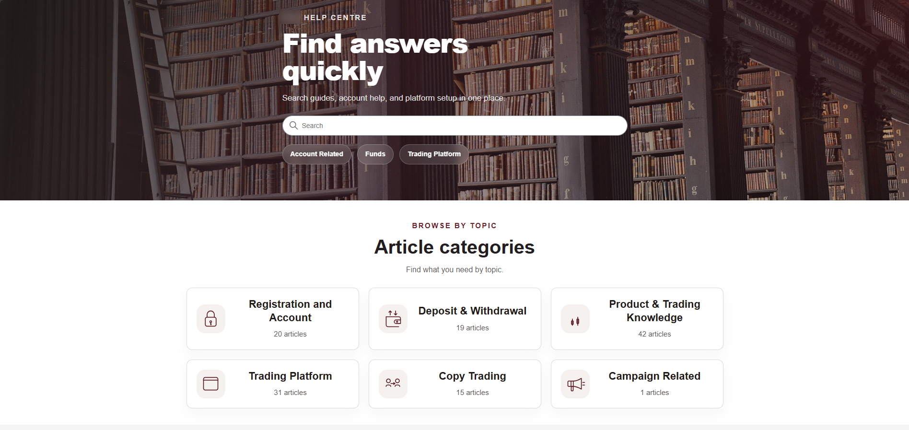
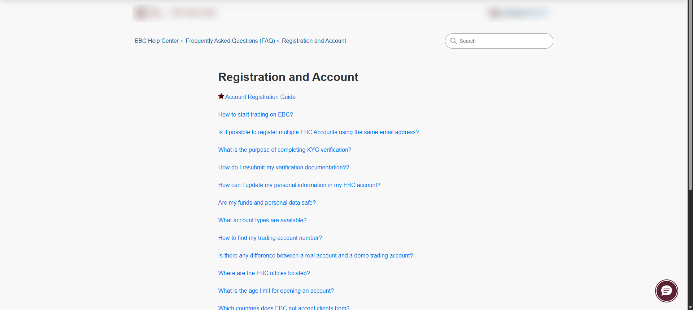
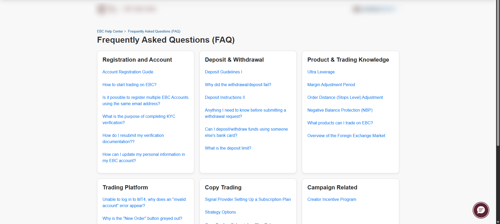
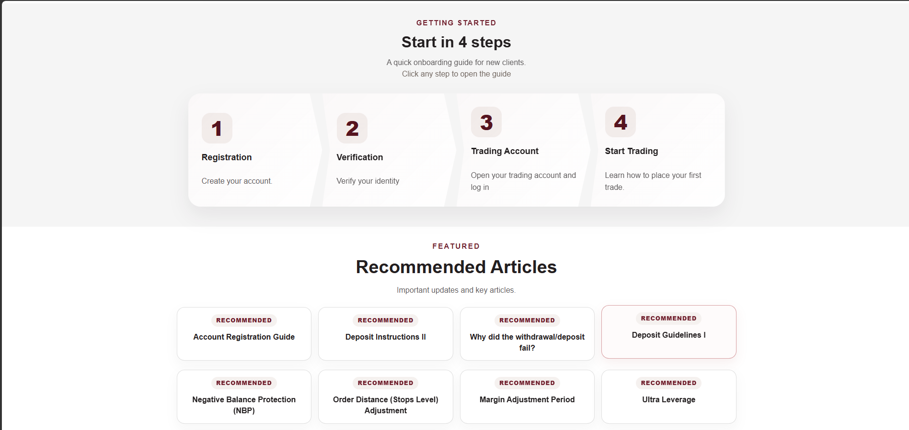

# Navigation Restructure Case Study

## Overview

This case study documents a reconstructed Help Center UX modernization project focused on improving navigation efficiency, onboarding accessibility, and article discoverability within a Zendesk Guide environment.

The redesign focused on reducing unnecessary navigation depth and simplifying how users access operational content.

---

# Objectives

The project aimed to:

- reduce navigation friction
- simplify article discovery
- modernize the homepage structure
- improve onboarding visibility
- reduce category-layer dependency
- improve operational accessibility for support-related articles

---

# Original Structure

The original Help Center structure relied heavily on category-based navigation.

Typical flow:

```plaintext
Homepage
→ Category
→ Section
→ Article
```

This created:
- excessive navigation depth
- inconsistent onboarding visibility
- reduced article discoverability
- unnecessary clicks before reaching operational content

---

# Restructured Navigation Flow

The redesigned structure shifted toward section-first navigation.

Updated flow:

```plaintext
Homepage
→ Section
→ Article
```

This reduced navigation depth and improved direct access to operational guides.

---

# Homepage Modernization

The homepage was redesigned to improve:
- onboarding visibility
- article categorization clarity
- visual consistency
- operational accessibility

Key improvements included:
- simplified category presentation
- redesigned article cards
- onboarding journey section
- recommended article sections
- cleaner spacing and hierarchy
- modernized visual structure

---

# Navigation Improvements

The redesign introduced:
- section-first entry points
- reduced click depth
- improved article grouping
- clearer onboarding paths
- improved FAQ discoverability
- operational content prioritization

---

# UX Focus Areas

The restructuring focused heavily on:
- usability
- discoverability
- onboarding clarity
- workflow efficiency
- responsive layout behavior
- operational readability

---

# Technical Areas Involved

This project involved:
- Zendesk Guide customization
- HTML restructuring
- CSS layout redesign
- frontend UX refinement
- article grouping logic
- navigation restructuring
- documentation organization

---

# Before & After Examples

## Previous FAQ Structure

```plaintext
Homepage
→ FAQ Category
→ Registration Section
→ Article
```

## Updated FAQ Structure

```plaintext
Homepage
→ Registration Section
→ Article
```

This reduced unnecessary navigation layers and improved direct access to operational documentation.

---

# Homepage Comparison

## Previous Homepage


## Redesigned Homepage



---

# Navigation Restructure

## Legacy Section Page



## Previous FAQ Category Structure



## Updated Section-First Navigation


---

# Onboarding Experience

## Guided Onboarding Flow



---

# Operational Impact

The restructuring improved:
- onboarding accessibility
- support workflow efficiency
- article visibility
- navigation consistency
- operational readability

The redesigned structure also better supports multilingual documentation environments and future Help Center scalability.

---

# Notes

This document represents a reconstructed public case study based on Help Center UX modernization concepts and operational workflow design.

No proprietary systems, internal business logic, or client-sensitive infrastructure are included.
