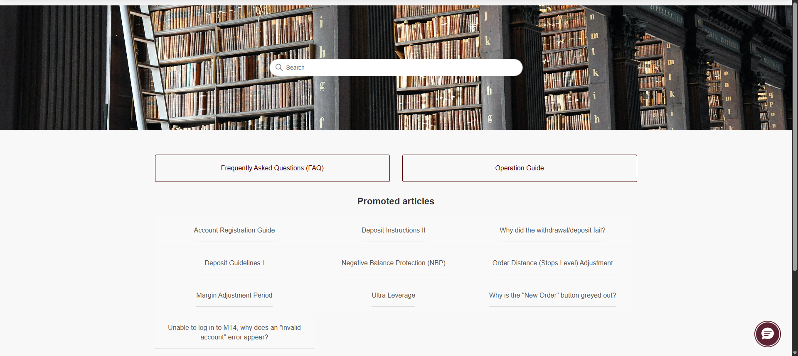
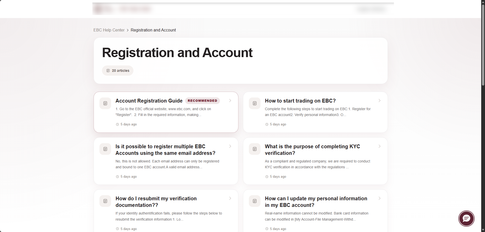

# Homepage Layout System

## Overview

This document outlines the reconstructed homepage redesign approach used for a Zendesk Guide customization workflow.

The redesign focused on improving:

- article discoverability
- onboarding visibility
- category clarity
- responsive usability
- operational navigation efficiency

---

# Design Goals

The homepage redesign aimed to:

- reduce visual clutter
- improve scanning behavior
- modernize Help Center appearance
- surface operationally important content
- simplify category access
- support multilingual expansion

---

# Previous Layout Problems

The legacy homepage relied heavily on:

- long article lists
- minimal visual hierarchy
- weak onboarding guidance
- low discoverability for important articles
- inconsistent category emphasis

## Legacy Homepage

---

# Redesigned Homepage Structure

The updated homepage introduced:

- hero search section
- category card grid
- onboarding milestone flow
- recommended article sections
- cleaner spacing system
- responsive component layouts

## Redesigned Homepage

---

# Category Card System

The redesign replaced text-heavy navigation with visual category cards.

Each category card includes:

- icon support
- article count
- improved spacing
- clearer hierarchy
- responsive alignment

## Category Layout Example

---

# Onboarding Milestone Block

A guided onboarding section was introduced to help new users quickly understand the account setup process.

The onboarding flow focused on:

1. registration
2. verification
3. account setup
4. first trade guidance

## Onboarding Example

---

# UX Considerations

The redesign emphasized:

- readability
- operational clarity
- lower cognitive load
- scalable component structure
- responsive spacing
- visual consistency

Special attention was given to balancing operational density with usability.

---

# Technical Concepts

The reconstructed implementation explores concepts involving:

- Zendesk Guide customization
- custom homepage templating
- CSS Grid layouts
- responsive spacing systems
- section card rendering
- reusable UI components
- multilingual content support

---

# Notes

This is a reconstructed demonstration project intended for portfolio and documentation purposes.

No proprietary backend systems or internal infrastructure are included.
