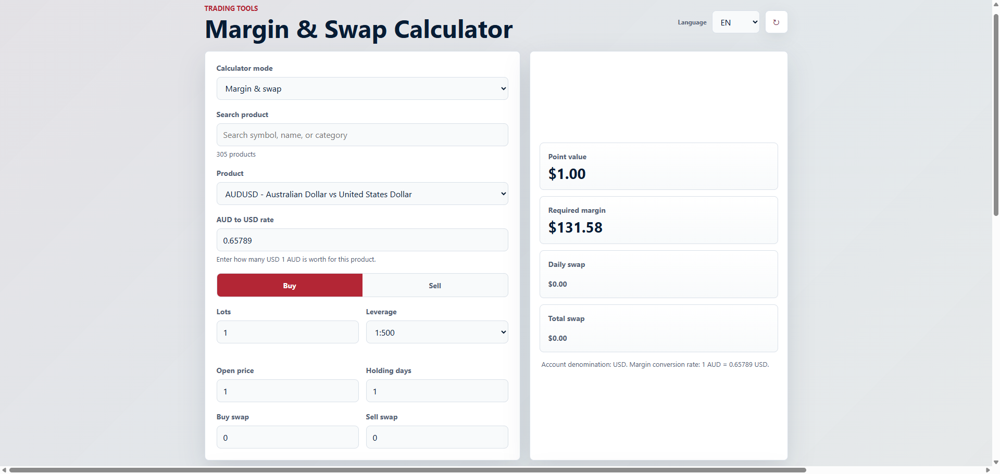
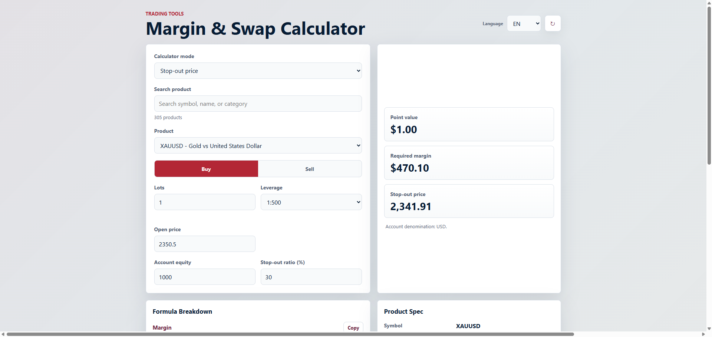
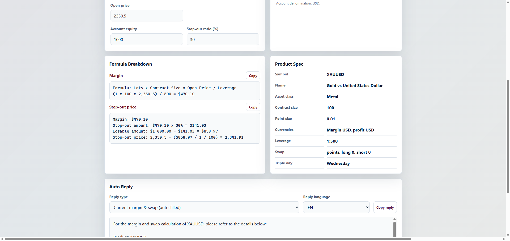
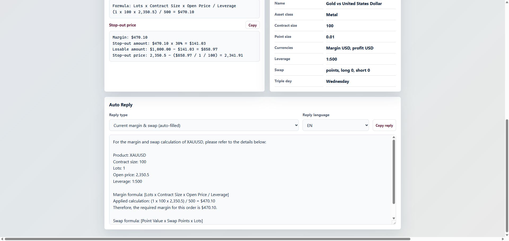
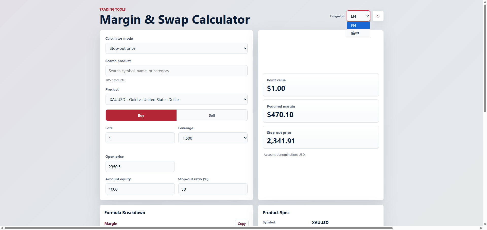

# Margin & Swap Calculator

A reconstructed operational trading support tool designed to simplify margin, swap, and stop-out estimation workflows.

- This tool is intended for internal operational workflow demonstrations and support-side calculation assistance.
- Auto-reply examples are reconstructed workflow samples for demonstration purposes and are not client-facing production templates.

## Tech Stack

- HTML
- CSS
- JavaScript
- Responsive frontend design
- Lightweight client-side calculation logic

---

## Overview

---

## Features

- Margin calculation
- Swap estimation
- Stop-out mode
- Formula breakdown
- Auto-reply generation
- Multi-language support
- Responsive layout

Designed for operational support scenarios involving CFD, forex, metals, and leveraged trading products.

---

## Stop-out Calculation

---

## Formula Breakdown

---

## Auto-reply Generation

---

## Multi-language Interface

---

## Purpose

This project explores lightweight operational tooling concepts for support environments handling trading-related enquiries and calculations.

The focus is on:
- workflow efficiency
- frontend usability
- operational clarity
- multilingual structure
- AI-assisted development workflows

---

## Notes

This is a reconstructed public demonstration project and does not contain proprietary backend systems or internal infrastructure.
This project is intended for portfolio and workflow demonstration purposes only.
